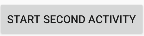
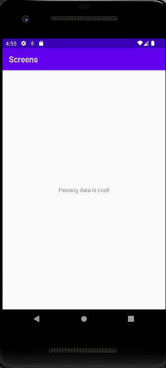

# Rapport

The first thing i did was to fork the app "screens" as well as 
clone it to android studios. After this, i created the second activity
(SecondActivity.java) and created a button in the first activity
that starts the second one. The button looks like this: 
After this i added data to intent bundle by using extras. The code
for this looks like this:

@Override
public void onClick(View v) {
Intent intent = new Intent(MainActivity.this, SecondActivity.class);

                // Create a Bundle object and add data to it
                Bundle bundle = new Bundle();
                bundle.putString("message", "Passing data is cool!");

                // Pass Bundle object to Intent.
                intent.putExtras(bundle);

                // Start second activity
                startActivity(intent);

Finally, i created a widget to show the data from intent bundle, the final
result looks like this:
